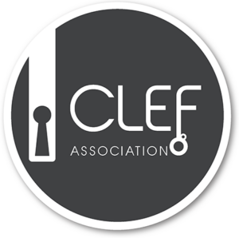

# SimpleText@CLEF-2022 Accueil

[Accueil](./) | [Appel à communication](./CFP) | [Dates importantes](./dates) | [Tâches](./tasks)  
[Programme](./program) | [Publications](./publications) | [Organisation](./organisation) | [Contacts](./contacts) | [Affiche](./affiche) | [Poster](./poster) | [Video](./video) | 

---

  

## SimpleText-2021 : Simplification automatique des textes scientifiques

*SimpleText est un nouvel atelier organisé dans le cadre de la [conference CLEF-2022](https://clef2022.clef-initiative.eu/), lancée par [l'initiative CLEF](http://www.clef-initiative.eu/).*

 ## Objectifs et sujet de l'atelier
SimpleText aborde les défis techniques et les défis d’évaluation en fournissant des données et des repères appropriés pour la simplification du texte.
Nous proposons les tâches suivantes :
* [Tâche 1: Que garder ou supprimer?](./task1): Sélectionne les passages à inclure dans un résumé simplifié, à partit d'une requête 
* [Tâche 2: Qu'est-ce qui n'est pas clair?](./task2): Ayant un passage et ene requête, classe les termes/concepts à expliquer pour comprendre ce passage (définitions, contexte, applications,...).
* [Tâche 3: Réécris le texte](./task3): Avec une requête, simplifie passages des résumés scientifiques.
* [Tâche non partagée](./): C'est votre choix!

Pour faire face à ces défis, SimpleText vise à répondre aux questions de recherche suivantes :
  QR1 - Quelle expression textuelle porteuse d'information doit être simplifiée (document et passage à inclure dans le résumé simplifié)?
  QR2 - Quel type d'information de base devrait être fourni (quels termes devraient être contextualisés en donnant une définition et/ou une application)? Quelles informations sont les plus pertinentes ou les plus utiles?
  QR3 - Comment améliorer la lisibilité d'un texte court donné (par exemple en réduisant le vocabulaire et la complexité syntaxique) avec un taux acceptable de distorsion de l'information?

## Importance pour le domaine et Pertinence pour la CLEF
Les systèmes d’accès à l’information fournissent aux utilisateurs des renseignements clés provenant de sources fiables comme la littérature scientifique; toutefois, les *non-experts* peuvent avoir tendance à éviter ces sources en raison de leur langage complexe ou de leur manque de connaissances de base. La simplification du texte élimine certains de ces obstacles. SimpleText sera un pas en avant pour rendre la recherche vraiment ouverte, accessible et compréhensible pour tous et aider à contrer les *fakes news* (fausses novelles) basées sur des résultats scientifiques. Il permettra aux gens de lire plus rapidement, ce qui les rendra plus conscients des résultats scientifiques. Cela est particulièrement important en raison de l’explosion de la science ouverte pendant la pandémie actuelle de COVID-19. Les textes simplifiés sont plus accessibles pour les locuteurs *non natifs*, les jeunes lecteurs et les personnes ayant des difficultés de lecture. D'autre part, la simplification du texte permet d’améliorer les applications de traitement du langage naturel (TLN), y compris les résultats de traduction automatique. La simplification automatique des textes pourrait être utile pour divers domaines tels que la communication scientifique, le journalisme scientifique, la politique et l’éducation. La simplification du texte peut être utilisée dans la traduction (traduction assistée par ordinateur et localisation de sites Web, pré-édition) et la rédaction technique.

Bien que quelques études aient été réalisés dans le domaine de la simplification automatique de textes [1], [2], cela reste une tâche difficile. A notre connaissance, il n'existe aucun jeu de données de RI multilingue dans lequel un résumé est écrit dans une langue différente de celle du texte complet. La grande majorité de la littérature est consacrée aux textes en anglais. Peu de travaux ont été réalisés pour des données françaises [3]-[7] et ils ne prennent pas en compte les tâches de sélection de l'information ni ne fournissent de connaissances de base. Contrairement aux projets précédents, SimpleText vise à fournir des connaissances de base manquantes tout en gardant le texte aussi court que possible afin d'aider l'utilisateur à comprendre un texte complexe qui ne peut pas être simplifié davantage sans une distorsion importante de l'information. La recherche de connaissances de base est proche de la piste INEX/CLEF Tweet Contextualization 2011-2014 [27] et de l'atelier CLEF Cultural micro-blog Contextualization 2016, 2017 [34], mais SimpleText s'en distingue en mettant l'accent sur une sélection de notions à expliquer et sur l'utilité des informations fournies plutôt que sur leur pertinence.

## Scénarios
L'objectif est de créer un résumé simplifié de plusieurs documents scientifiques à partir d'une requête donnée, ce qui permet à l'utilisateur d'obtenir instantanément un résumé simplifié sur un sujet spécifique qui l'intéresse ou de générer un résumé quotidien, par exemple pour ArXiv.

## Configuration de l’évaluation, paramètres et tâches
Ensemble de données en anglais : Nous utilisons le * Citation Network Dataset* : DBLP+Citation, réseau ACM Citation (https://www.aminer.org/citation). Un index de recherche élastique est fourni aux participants par le biais d’une API GUI. Cet index est adéquat pour :
* appliquer des méthodes de base de recherche de passages basées sur des modèles de RI vectoriels ou linguistiques,
* générér des modèles d'Allocation de Dirichlet Latente,
* former des *Graph Neural Networks* pour la recommandation de citation, comme c'est le cas sur https://stellargraph.readthedocs.io/ par exemple,
* appliquer des Transformers bidirectionnels profonds pour l'expansion de requêtes ... requêtes en anglais : Pour cette édition, les requêtes sont une sélection de titres de presse récents du Guardian enrichie de mots-clés extraits manuellement du contenu des articles. Il a été vérifié que chaque mot-clé permet d'extraire au moins 5 résumés pertinents. L'utilisation de ces mots-clés est facultative.

Format d'entrée pour toute les tâches:
* Sujets au format MD.
* Articles en texte intégral du Guardian (lien, dossier avec les textes intégraux au format MD).
* Index *ElasticSearch* sur le serveur de données.
* Dépôt complet de DBLP au format JSON.GZ
* Résumés DBLP extraits pour chaque sujet dans le format MD suivant (doc_id, année, résumé).

---

&nbsp;&nbsp;&nbsp;&nbsp;&nbsp;&nbsp;&nbsp;&nbsp;&nbsp;&nbsp;&nbsp;&nbsp;&nbsp;&nbsp;&nbsp;&nbsp;  &nbsp;&nbsp;&nbsp;&nbsp;&nbsp;&nbsp;&nbsp;&nbsp;&nbsp;&nbsp;&nbsp;&nbsp;&nbsp;&nbsp;&nbsp;&nbsp;&nbsp;&nbsp;&nbsp;&nbsp;&nbsp;&nbsp;&nbsp;&nbsp;  
